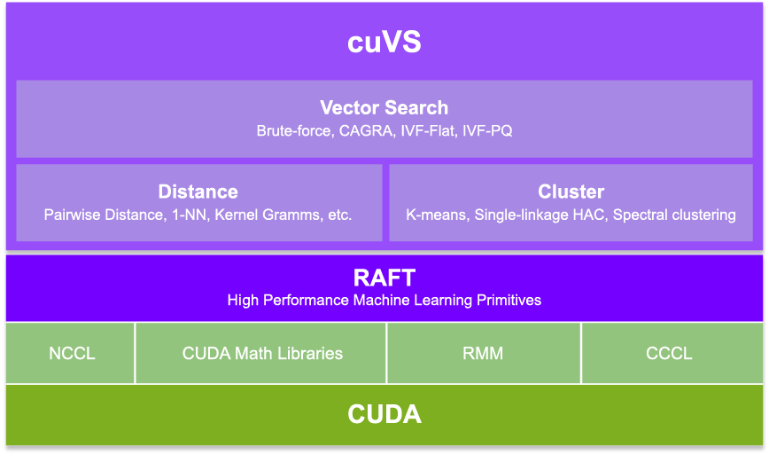

# Accelerating vector search with RAPIDS cuVS

Vector search is important because it underpins many data mining and artificial intelligence applications, particularly retrieval augmented generation (RAG) workflows. In a typical RAG pipeline, text queries are encoded into numerical embeddings. Thes embeddings are then then searched against a collection of domain specific embeddings (often stored in vector databases). The job of vector search is to find results that are similar to the query embeddings using nearest neighbor algorithms. K-nearest neighbor (kNN) algorithms are the most accurate, but they are also the most computationally intensive. Approximate nearest neighbor (ANN) algorithms sacrifice a little accuracy for huge performance gains. In this talk we will introduce [RAPIDS cuVS](https://rapids.ai/cuvs/), an open-source library for vector search, and show how to use its ANN algorithms on a GPU.

## RAPIDS cuVS

Leveraging the [cuVS](https://rapids.ai/cuvs/) library, vector search operations achieve unmatched speed by delivering better index build times, higher throughput, and lower latency at every level of recall. [cuVS](https://rapids.ai/cuvs/) exploits the parallel architecture of NVIDIA GPUs, allowing for deployment of complex algorithms like IVF-PQ, IVF-flat, and CAGRA. GPU-acceleration of vector similarity search sets benchmark records for large-scale, high-performance solutions.

## ASU GPU Day 2024

[GPU Day](https://researchacademy.asu.edu/gpuday2024
) is an annual one-day expo hosted by ASU Research Computing to educate faculty, students, and staff on how to use GPUs on the Sol supercomputer. The intent is to inspire and motivate our research community to use Research Computing's supercomputing systems and to showcase the important applications of these powerful GPU resources. This event will include in-depth and interactive training for unleashing the potential of GPUs and AI in software acceleration, harnessing large language models, and tutorials for [RAPIDS](https://rapids.ai/) with special guests from NVIDIA. 

